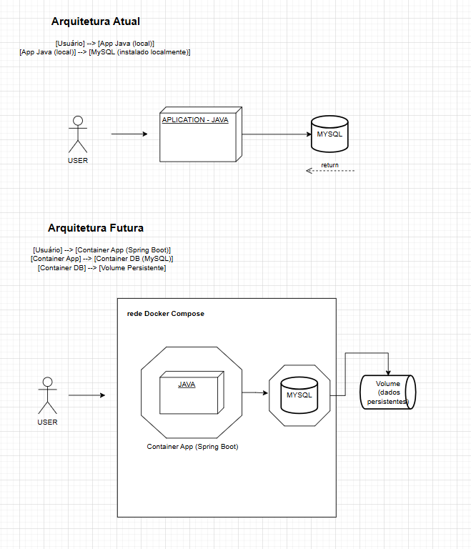

# DimDim – Checkpoint Docker Compose

Projeto simples de **API de Transações** (Spring Boot + MySQL) para demonstrar **containerização com Docker Compose**.

## Arquitetura



- **Atual (antes):** App Java rodando localmente + MySQL instalado na máquina.
- **Futura (depois):** 2 containers: `app` (Spring Boot) e `db` (MySQL) orquestrados por `docker-compose`, com rede e volume.

## Requisitos

- Docker e Docker Compose
- (Opcional) Java 21 + Maven se quiser rodar localmente fora do Docker

## Como rodar com Docker Compose

```bash
# na raiz do projeto (onde está docker-compose.yml e Dockerfile)
docker compose build
docker compose up -d
docker compose ps

### . A API subirá em: http://localhost:8080.

Health: GET http://localhost:8080/actuator/health

Swagger UI: http://localhost:8080/swagger-ui.html
```

## Endpoints principais

- GET /api/transactions – lista todas

- GET /api/transactions?type=INCOME – filtra por tipo

- GET /api/transactions?start=2025-01-01T00:00:00&end=2025-12-31T23:59:59 – por período

- GET /api/transactions/{id}

- POST /api/transactions

- PUT /api/transactions/{id}

- DELETE /api/transactions/{id}


- Exemplo de payload (POST/PUT)
```
{
  "description": "Salário",
  "amount": 3500.00,
  "type": "INCOME",
  "date": "2025-08-01T10:00:00"
}

```

### Comando essenciais
```
docker compose up -d
docker compose logs -f app
docker compose logs -f db
docker compose exec db mysql -uroot -proot -e "SHOW DATABASES;"
docker compose ps
docker compose down

```